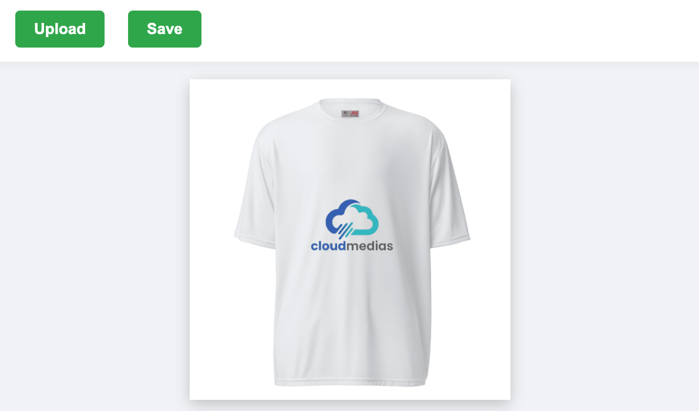

# PrintStudio
### React UI to upload and position artwork on a product specifically for Printful API. Powered by Fabrid.js. 



Install:


`$ npm install printstudio`

Set properties template area, print area, image url, background color, print file area and optional export function or browser file save is prompted.


```
import PrintStudio from 'printstudio';
import 'printstudio/dist/printstudio.css';

const config = {
  template_width: number,
  template_height: number,
  print_area_width: number,
  print_area_height: number,
  print_area_top: number,
  print_area_left: number,

  image_url: string,
  background_color?: string | null,

  printfile_width: number,
  printfile_height: number,
  printfile_dpi: number,

  onExportComplete?: (file: File) => void | Promise<void>,
  onSaveThumb?: (file: File) => void | Promise<void>
}


...

<PrintStudio config={config} />

```